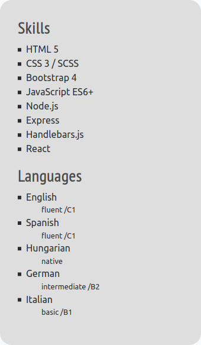
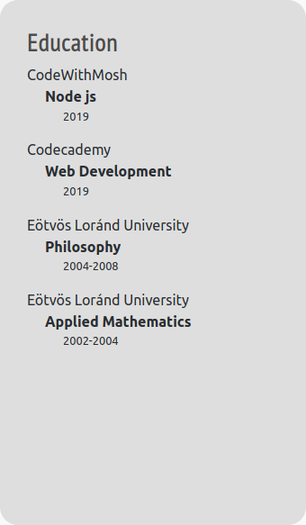
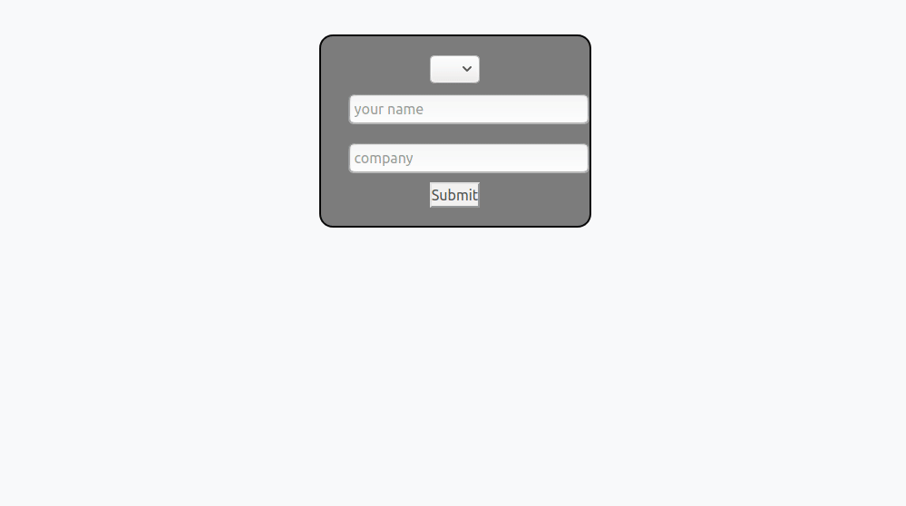

# This is my very old Portfolio website

  <a href="https://zsuzsamano.github.io/Me">
  zsuzsamano.github.io/Me
  </a>
 

<!-- PROJECT LOGO -->
 

  

  HTML, CSS, React

***
It has my resume and a customizable Cover Letter generator.
A small React experiment

***
### Resume

  

 

  

 

  

 

### Cover Letter Generator

  

 
